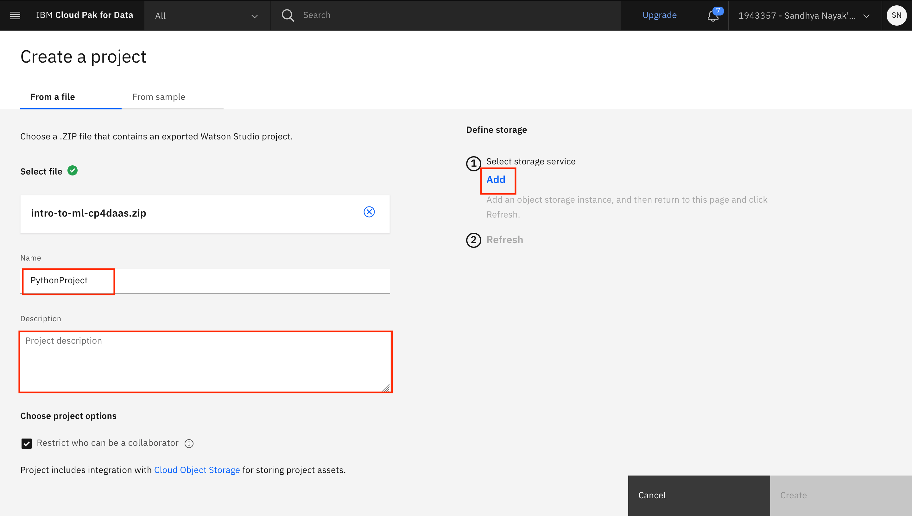
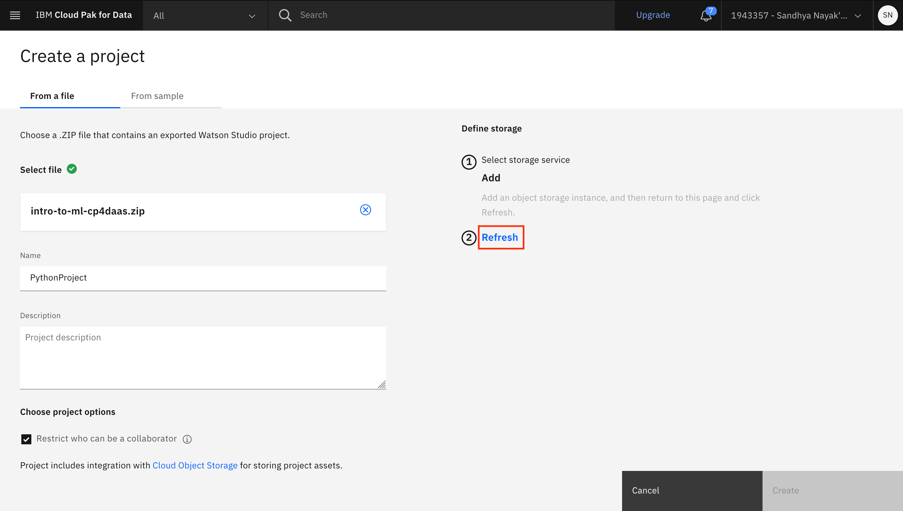
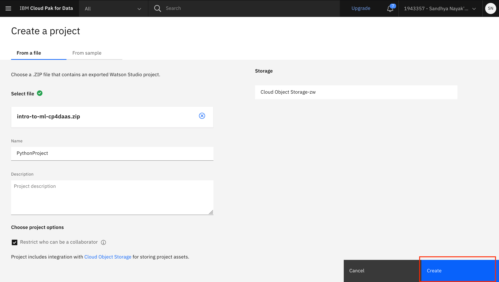

# Workshop Setup

Before we get started with the workshop, you will need to download some assets and setup your environment. 

This section is broken up into the following steps:

  1. [Download Assets](#1-download-assets)
  2. [Create IBM Cloud account and service](#2-create-ibm-cloud-account-and-service)
  3. [Create a project](#3-create-a-project)

!!! info
    You can click on any image in the instructions below to zoom in and see more details. When you do that just click on your browser's back button to return to the previous page.

## 1. Download Assets

Throughout this workshop, you'll be asked to run different notebooks. These artifacts have been collected in the following zip file which you can download using the links below. For each line below, click on the `[Download]` link to get the file. If the link isn't working for you, try clicking the `[Mirror]` to get it from a backup server. You'll need these files in the next sections.

[Download the project](https://github.com/IBM/intro-to-ml-with-sklearn/raw/main/workshop/assets/project-archives/intro-to-ml-cp4daas.zip){ .md-button }
<!-- * Intro to ML with sklearn [Cloud Pak for Data Project] -  -->
<!-- [[Download]](http://ibm.biz/DDC2021-jumpstart-your-journey)  -->
<!-- | [[Mirror]](https://github.com/IBM/ddc-2021-jumpstart-your-journey/raw/main/projects/jumpstart-your-journey.zip) -->

!!! attention
    **DO NOT** unzip the downloaded file. Specifically, MacOS unzips and removes the zipped file that you just downloaded if you double click on it. Cloud Pak for Data needs the zipped file so make sure you do not accidentally unzip it.

## 2. Create IBM Cloud account and service

We need to provision our Cloud Pak for Data as a Service instance. Cloud Pak for Data provides you with an integrated set of capabilities for collecting and organizing your data into a trusted, unified view, and then creating and scaling AI models across your business.

* Launch a web browser and navigate to IBM Cloud Pak for Data using the region [US, Dallas.](https://dataplatform.cloud.ibm.com/registration/stepone?context=cpdaas&apps=all&regions=us-south&preselect_region=true)

* You can then log in using your IBMid if you have one or create a new IBMid.

    * If you do not have an IBMid, enter your email address and accept the terms checkbox in the `Create a new IBM Cloud Account` section. Then click the `Next` button to complete the process of creating a new account. See the [FAQ](#faq) section for help.
    * If you are a returning user, click on the `Log in with your IBMid` link.
      
    !!! info
          If you are a returning user and you have watson services in a different region than the pre-selected one, you will see an error message telling you to select that region instead. See the [FAQ](#faq) section for help.

    

* The services required for IBM Cloud Pak for Data will be automatically provisioned for you. Once you see a message that says that the apps are ready to use, click on `Go to IBM Cloud Pak for Data`.

    

## 3. Create a project

### Import the Project

In Cloud Pak for Data, we use the concept of a project to collect / organize the resources used to achieve a particular goal (resources to build a solution to a problem). Your project resources can include data, collaborators, and analytic assets like notebooks and models, etc.

* Once you are on [Cloud Pak for Data as a Service](https://dataplatform.cloud.ibm.com). Click on the (☰) navigation menu on the top left, expand *Projects* and click on the *View all projects* link.

    

* Click on the `New project` button on the top. 

    !!! info
        If you already have existing projects, your screen will look different from the screenshot below. In that case, click on the `New project +` button on the top right.

    

* Click on `Create a project from a sample or file`.

    

* Click on the **browse** link and in the file browser popup, navigate to where you downloaded the files for this lab. Then select the `intro-to-ml-cp4daas.zip`. Click `Create`.

    

    !!! attention
        Remember that you need the zipped file. If you have accidentally unzipped it, download the file again from the [Download Assets](#1-download-assets) section.

* Give the project a name and optional description. You also need to provide an object storage instance for this project. If you have not previously created a Cloud Object Storage instance in your IBM Cloud account, you can create one now by clicking `Add`. *Note: If you do have an existing storage service, select it from the drop down list and click the `Create` button.*

    

* A new tab opens up, where you can create the Cloud Object Service. By default, a `Lite` (Free) plan will be selected. Scroll down and update the name of your Cloud Object Storage service if you wish, and click `Create`.

    

* The browser tab will automatically close when the Cloud Object Storage instance has been created. Back on IBM Cloud Pak for Data as a Service, click `Refresh`.

    

* The newly created Cloud Object Storage instance will now be displayed under "Storage". Click `Create` to finish creating the project.

    

* Once the project is successfully created you will be brought to the project overview page (*Note:You may be presented with a project tour pop up window, go ahead and close it*)

    

## 4. Create a Space for Machine Learning Deployments

Cloud Pak for Data uses the concept of *Deployment Spaces* to configure and manage the deployment of a set of related deployable assets. These assets can be data files, machine learning models, etc.

* Go the (☰) navigation menu, expand **Deployments** and click **View all spaces**.

* Click on the **New deployment space +** button.

* Give your deployment space a unique name, optional description, then click the **Create** button.

* From the deployment space creation pop up window, click on the **View new space** button to view your space.

<!-- 
## 4. Upload the data

We'll use a data set from [Kaggle](https://www.kaggle.com/) for this workshop. You'll need to download it to your local machine, then upload to your project running in Cloud Pak for Data as a Service.

* Download the data to your laptop or PC by [clicking this link](https://www.kaggle.com/noordeen/insurance-premium-prediction/download).

* In your project, click on `Add to project +` and then choose the tile for `Data`. Alternately, under *Data assets* click `New data asset +`.

* Wait on this page until the upload completes. You should see the file `insurance.csv` under your *Data assets*.

You are now ready to move on to the next module of this workshop. 
-->

## FAQ
 
**Q1: I get the `That email address is already registered to an IBM Cloud account.` messsage.**

A: You must already have an IBMid account. Follow the login link provided in the error message to login to your existing account. 

**Q2: The Sign Up process was unsuccessful.**

A: Try creating a IBM Cloud account directly using [IBM Cloud Registration](https://cloud.ibm.com/registration) in a different browser first. Once you have your IBM Cloud account set up, you can use the link in [Section 2](#2-create-ibm-cloud-account-and-service).

## 6. Conclusion

At this point we are done with this section. We have completed creating an IBM Cloud account, a Cloud Pak for Data as a Service instance, the project that we will use in the rest of this workshop and the deployment space where we will deploy our ML models.
