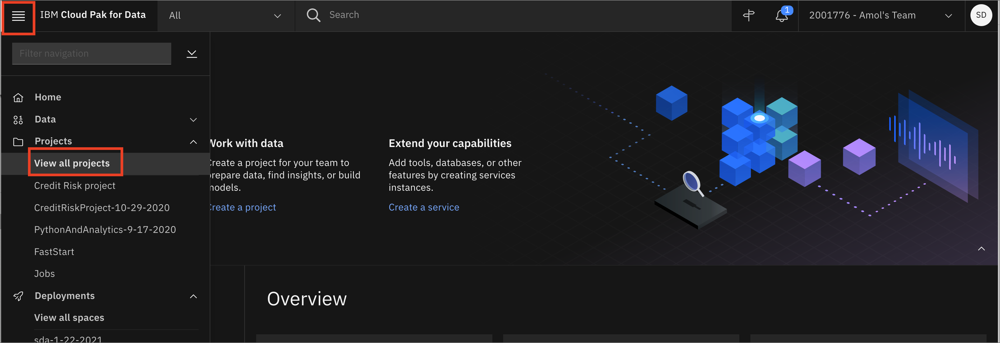
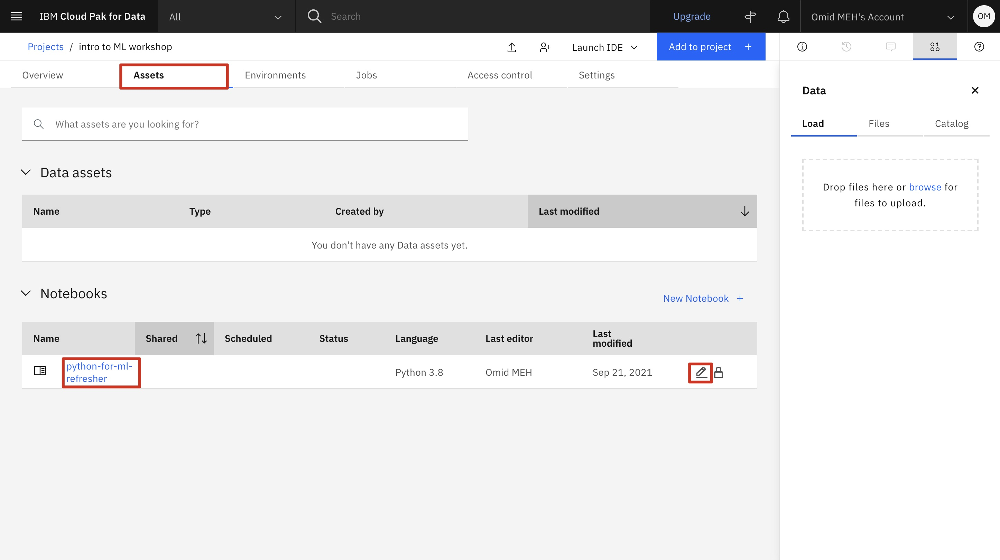
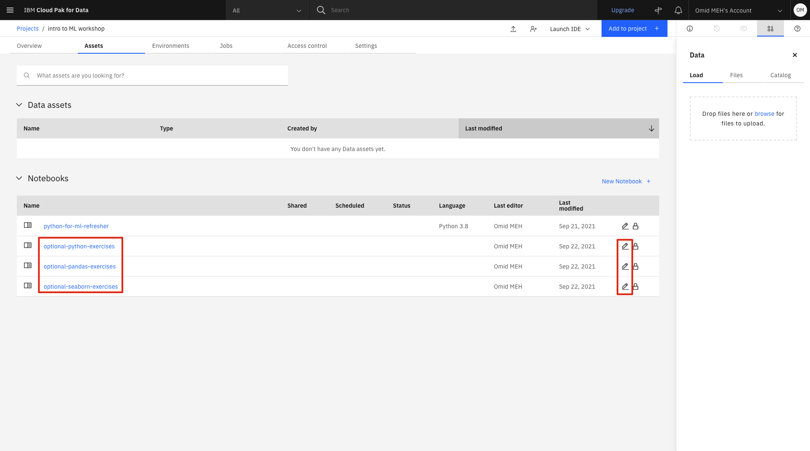

# Python for ML Refresher

In this section we will do a quick review of the following topics which will help you refresh your python skills so you can follow the rest of this workshop.

Note that while you could greatly benefit from the optional sections, you don't have to follow them for this workshop.

1. [Definitions](#1-definitions)
    1. [What is Python](#11-what-is-python)
    2. [What is a Jupyter Notebook](#12-what-is-a-jupyter-notebook)
    3. [What is Pandas](#13-what-is-pandas)
    4. [What is Seaborn](#14-what-is-seaborn)
2. [Exercises](#2-exercises)
    1. [Refresher](#21refresher)
        - [Open the Jupyter notebook](#open-the-jupyter-notebook)
        - [Run the Jupyter notebook](#run-the-jupyter-notebook)
    2. [Optional Introductory Exercises](#22-optional-introductory-exercises)

## 1. Definitions

### 1.1 What is Python

You might think that **Python** is only for developers and people with computer science degrees. However, Python is great for beginners, even those with little coding experience because it’s free, open source, and runs on any platform. The Python packages documentation is great, and after an [introductory course](https://cognitiveclass.ai/learn/data-science-with-python), you have a good foundation to build on.

For Data Scientists, Python has become an invaluable tool. This notebook will help you get started or review the basics of Python.

### 1.2 What is a Jupyter Notebook

Instead of writing code in a text file and then running the code with a Python command in the terminal, you can do all of your data analysis in one place. Code, output, tables, and charts can all be edited and viewed in one window in any web browser with [Jupyter Notebooks](https://jupyter.org/). As the name suggests, this is a notebook to keep all of your ideas and data explorations in one place. In this tutorial, you use [IBM Watson Studio](https://dataplatform.cloud.ibm.com/docs/content/wsj/getting-started/overview-ws.html) to run a notebook. For this, you need a free IBM Cloud account. The following steps show you how sign up and get started. When you have the notebook up and running, you can go through the notebook.

Jupyter notebooks are an open-source web application that allows you to create and share documents that contain live code, equations, visualizations and explanatory text.

!!! info
    In this workshop we will use IBM Watson Studio to run a notebook.
    If you have not already done so, make sure that you do set up your account by following the [project setup](./00-project-setup.md) module.

### 1.3 What is Pandas

[Pandas](https://pandas.pydata.org/) is a fast, powerful, flexible and easy to use open source data analysis and manipulation tool,
built on top of the Python programming language.

Throughout this workshop, we will be using Pandas to load, explore, and manipulate the data into the format needed for training our Machine Learning models later.

### 1.4 What is Seaborn

While loading the data and exploring the statistical information about is useful, often times we find useful insight in visual representations of the data. This is why there are numerous open-source libraries available in Python to enable data visualization. `matplotlib` and `seaborn` are two of the most popular libraries in this category. 

!!! info
    **`seaborn` vs. `matplotlib`:** `seaborn` is a higher level library wrapped around `matplotlib` and it is highly tailored to visualizing the data structures that `Pandas` uses. This means that if you can achieve what you need using `seaborn`, that route will almost always be simpler and quicker.

If you need more details on how to customize your plots or looking for the syntax to create specific plots, the best place to start is the [documentation of `matplotlib` ](https://matplotlib.org)and the [documentation of `seaborn`](https://seaborn.pydata.org) as they are filled with examples and sample codes.

## 2. Exercises 

### 2.1 Refresher

For this workshop, you are only required to complete the refresher. However, if would like to start with simpler exercises to build your skills, check out the [Optional Introductory Exercises](#22-optional-introductory-exercises) section.

#### Open the Jupyter notebook

1. Go the (☰) navigation menu and under the *Projects* section click on *`All Projects`*.

      

2. Click the project name you created in the pre-work section.

3. From your `Project` overview page, click on the *`Assets`* tab to open the assets page where your project assets are stored and organized.

4. Scroll down to the `Notebooks` section of the page and click on the pencil icon at the right of the `python-for-ml-refresher.ipynb` notebook.

      
    
    !!! note
        You may see more notebooks than just the one in this screenshot.

5. When the Jupyter notebook is loaded and the kernel is ready, we will be ready to start executing it in the next section.

#### Run the Jupyter notebook

Spend some time looking through the sections of the notebook to get an overview. A notebook is composed of text (markdown or heading) cells and code cells. The markdown cells provide comments on what the code is designed to do.

You will run cells individually by highlighting each cell, then either click the `Run` button at the top of the notebook. While the cell is running, an asterisk (`[*]`) will show up to the left of the cell. When that cell has finished executing a sequential number will show up (i.e. `[17]`).

!!! hint
    You can also run a cell by pressing `Shift + Enter` on your keyboard instead of clicking the run (:material-play:) button.

* Finish running all of the cells. Carefully read all of the markdown comments to gain some understanding of how data vizualization can be use to gain insight into the data set.

### 2.2 Optional Introductory Exercises 

There are additional notebooks in the file that you imported with names such as `optional-<library name>-exercises` where `<library name>` is the name of the library exercises included in that notebook. 

You can follow these notebooks first if you would like to start with more introductory exercises first to get up to speed with the tools used in this workshop

To open these notebooks, follow the steps outlined in [Open The Jupyter Notebook](#open-the-jupyter-notebook) and in step 4, open one of the optional notebooks.

## Summary

In this module we went through refresher exercises in Python, `Pandas`, and `Seaborn` which should prepare us for the rest of this workshop.