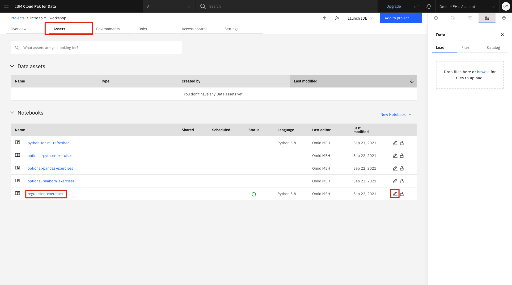

# Regression Exercise

## What is regression in machine learning?¶

Regression in machine learning is a technique that to predict a **continuous value** (also known as the *target feature*) based on a set of input values (*features*). An example of this could be predicting price of residential houses based on certain properties of the house (eg. zip code, area, floors, garage type, etc). 

## Objectives

By the end of this module, the participant will have learned:

- What regression in Machine Learning is
- Basics of Data prepration for Regression Algorithms
- Basics of training a Regression Model using `sklearn`

## About the DataSet

<!-- todo -->

## Open the Jupyter notebook

1. Go the (☰) navigation menu and under the *Projects* section click on *`All Projects`*.

      

2. Click the project name you created in the [Workshop Setup](00-project-setup.md) section.

3. From your `Project` overview page, click on the *`Assets`* tab to open the assets page where your project assets are stored and organized.

4. Scroll down to the `Notebooks` section of the page and click on the pencil icon at the right of the `regression-exercises.ipynb` notebook.

      
    
    !!! note
        You may see more notebooks than just the one in this screenshot.

5. When the Jupyter notebook is loaded and the kernel is ready, we will be ready to start executing it in the next section.

## Run the Jupyter notebook

Spend some time looking through the sections of the notebook to get an overview. A notebook is composed of text (markdown or heading) cells and code cells. The markdown cells provide comments on what the code is designed to do.

You will run cells individually by highlighting each cell, then either click the `Run` button at the top of the notebook or hitting the keyboard short cut to run the cell (`Shift + Enter` but can vary based on platform). While the cell is running, an asterisk (`[*]`) will show up to the left of the cell. When that cell has finished executing a sequential number will show up (i.e. `[17]`).

!!! note
    Some of the comments in the notebook (those in bold red) are directions for you to modify specific sections of the code. Perform any changes as indicated before running / executing the cell.

* Finishing running all of the cells. Carefully read all of the markdown comments to gain some understanding of how data visualization can be use to gain insight into the data set.

## Summary

In this module we learned the basics of unsupervised machine learning using linear regression and built our first machine learning model. You should not have the basic building blocks that you need to Start using different algorithms to explore your data and use it to build models.

Keep in mind that while this module is a great starting point, there is a lot more to be explored in the world of unsupervised machine learning and various types of algorithms to learn about. 

To learn more and for a more in-depth survey of commonly used algorithms in this field, click on the learn more button below and follow the learning path at your own time.

[Learn More about Regression](https://developer.ibm.com/learningpaths/learning-path-machine-learning-for-developers/learn-regression-algorithms/){ .md-button .md-button--primary }

