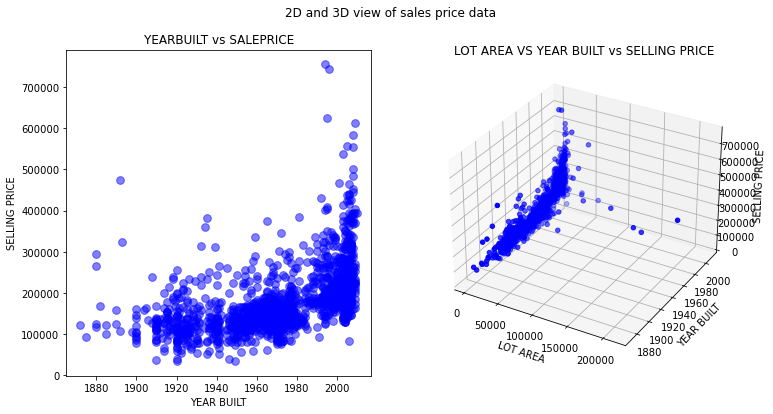
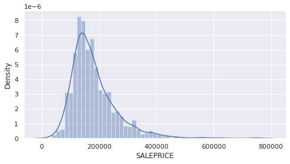

# Regression Exercise

## What is regression in machine learning?

Regression in machine learning is a technique used to predict a **continuous value** (also known as the *target feature*) based on a set of input values (*features*). An example of this could be predicting prices of residential houses based on certain properties of the houses (eg. zip code, area, floors, garage type, etc). 

## Objectives

By the end of this module, the participant will have learned:

- What regression in Machine Learning is
- Basics of Data preparation for Regression Algorithms
- Basics of training a Regression Model using `sklearn`

## About the Dataset

In this tutorial, we use a data set that contains various information that a home buyer considers before buying a house. We use this data to analyze how well we would be able to predict the house price given all of the other relevant information. 

Pay close attention to the pre-processing sections of the notebook associated with this module. The steps should give you an idea of the kinds of processing needed to prepare the data for regression models.

## Open the Jupyter notebook

1. Go the (☰) navigation menu and under the *Projects* section click on *`All Projects`*.

      

2. Click the project name you created in the [Workshop Setup](00-project-setup.md) section.

3. From your `Project` overview page, click on the *`Assets`* tab to open the assets page where your project assets are stored and organized.

4. Scroll down to the `Notebooks` section of the page and click on the pencil icon at the right of the `regression-exercises.ipynb` notebook.

      
    
    !!! note
        You may see more notebooks than just the one in this screenshot.

5. When the Jupyter notebook is loaded and the kernel is ready, we will be ready to start executing it in the next section.

## Run the Jupyter notebook

Spend some time looking through the sections of the notebook to get an overview. A notebook is composed of text (markdown or heading) cells and code cells. The markdown cells provide comments on what the code is designed to do.

You will run cells individually by highlighting each cell, then either click the `Run` button at the top of the notebook. While the cell is running, an asterisk (`[*]`) will show up to the left of the cell. When that cell has finished executing a sequential number will show up (i.e. `[17]`).

!!! hint
    You can also run a cell by pressing `Shift + Enter` on your keyboard instead of clicking the run (:material-play:) button.

## Summary

In this module we learned the basics of supervised machine learning using linear regression and built our first machine learning model. You should now have the basic building blocks that you need to Start using different algorithms to explore your data and use it to build models.

Keep in mind that while this module is a great starting point, there is a lot more to be explored in the world of supervised machine learning and various types of algorithms to learn about. 

To learn more and for a more in-depth survey of commonly used algorithms in this field, click on the learn more button below and follow the learning path at your own time.

If you are looking for a more in depth tutorial on different algorithms available for unsupervised learning, visit the [following tutorial](https://developer.ibm.com/learningpaths/learning-path-machine-learning-for-developers/learn-regression-algorithms/).

