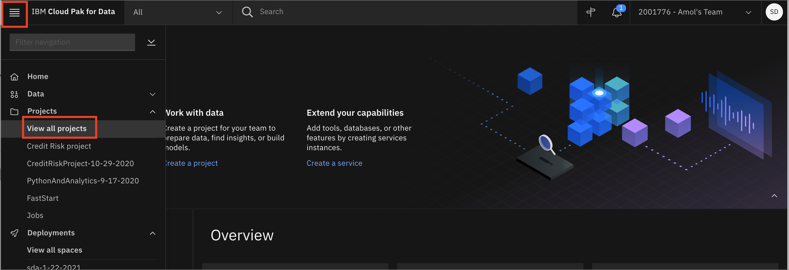

# Classification Exercise

## What is classification in machine learning?¶

Classification in machine learning is when the feature to be predicted contains categories of values. Each of these categories is considered as a class into which the predicted value falls and hence has its name, classification. An example of this could be predicting the parts of speech (verb, noun, adjective, etc.) of words with a given text. 

## Objectives

By the end of this module, the participant will have learned:

- What classification in Machine Learning is
- Basics of training a Naive Bayes Model using `sklearn`
- Basics of training a logistic regression model using `sklearn`

## About the DataSet

In this tutorial, we use a data set that contains information about customers of an online trading platform to classify whether a given customer’s probability of churn will be high, medium, or low. This provides a good example to learn how a classification model is built from start to end. The three classes that prediction will fall under are high, medium, and low. Now,

Data is available to us in the form of a .csv file and is imported using the pandas library. We use numpy and matplotlib to get some statistics and visualize data.

Pay close attention to the pre-processing sections of the notebook associated with this module. The steps should give you an idea of the kinds of processing needed to prepare the data for classification models.

## Open the Jupyter notebook

1. Go the (☰) navigation menu and under the *Projects* section click on *`All Projects`*.

      

2. Click the project name you created in the [Workshop Setup](00-project-setup.md) section.

3. From your `Project` overview page, click on the *`Assets`* tab to open the assets page where your project assets are stored and organized.

4. Scroll down to the `Notebooks` section of the page and click on the pencil icon at the right of the `regression-exercises.ipynb` notebook.

      
    
    !!! note
        You may see more notebooks than just the one in this screenshot.

5. When the Jupyter notebook is loaded and the kernel is ready, we will be ready to start executing it in the next section.

## Run the Jupyter notebook

Spend some time looking through the sections of the notebook to get an overview. A notebook is composed of text (markdown or heading) cells and code cells. The markdown cells provide comments on what the code is designed to do.

You will run cells individually by highlighting each cell, then either click the `Run` button at the top of the notebook or hitting the keyboard short cut to run the cell (`Shift + Enter` but can vary based on platform). While the cell is running, an asterisk (`[*]`) will show up to the left of the cell. When that cell has finished executing a sequential number will show up (i.e. `[17]`).

!!! note
    Some of the comments in the notebook (those in bold red) are directions for you to modify specific sections of the code. Perform any changes as indicated before running / executing the cell.

* Finishing running all of the cells. Carefully read all of the markdown comments to gain some understanding of how data visualization can be use to gain insight into the data set.

## Summary

In this module we learned the basics of supervised machine learning using the Naive Bayes and logistic regression models and compared the effectiveness of the two against the actual data.

To learn more and for a more in-depth survey of commonly used classification algorithms, click on the learn more button below and follow the learning path at your own time.

[Learn More about Classification](https://developer.ibm.com/learningpaths/learning-path-machine-learning-for-developers/learn-classification-algorithms/){ .md-button .md-button--primary }
