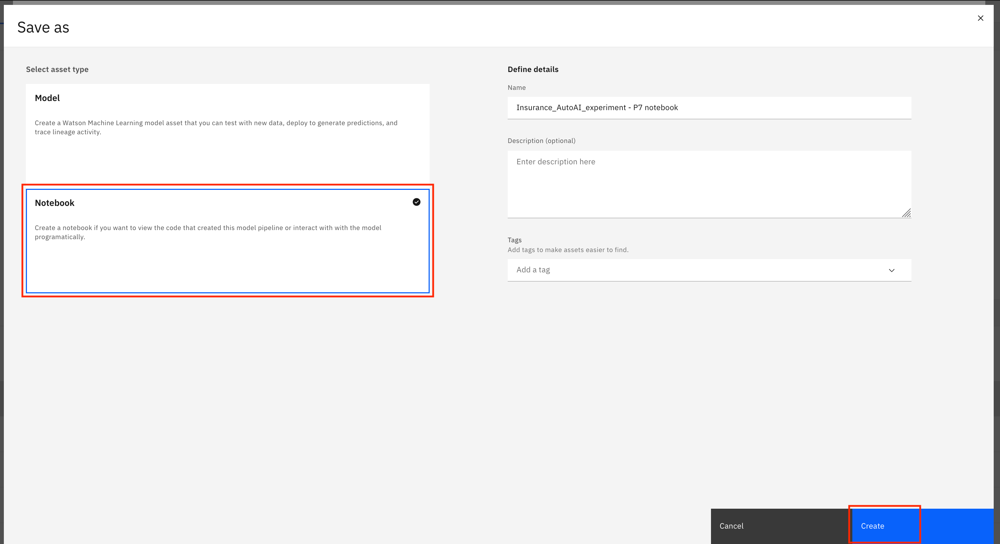
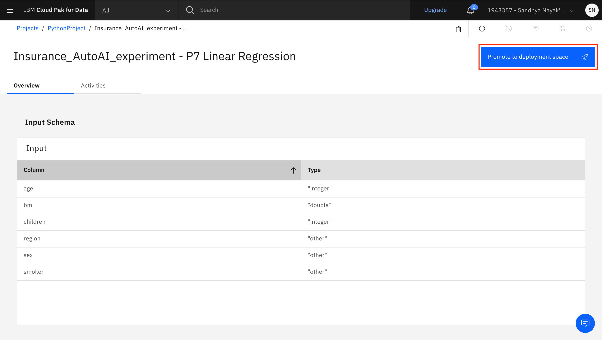

# Machine Learning Models with Auto AI 

In this workshop you will learn how to build and deploy your own AI Models.

For the workshop we will be using AutoAI, a graphical tool that analyses your dataset and discovers data transformations, algorithms, and parameter settings that work best for your problem setting.

Using AutoAI, you can build and deploy a machine learning model with sophisticated training features and no coding.

We will use a public dataset to build and deploy model pipelines, and analyse the outcome.

### Set up

Make sure that you have followed the steps in the [project setup](./00-project-setup.md) to create a project and set up your IBM Cloud account and Cloud Pak for Data as a Service.

### Add AutoAI experiment

* Go to your Project Overview page. 
* Click on **Add to Project** on the top right and select **AutoAI experiment**.


### Associate a Machine Learning service 

* Give your Auto AI experiment a unique name.
* **Associate a Watson Machine Learning service instance**. If you have already created one this will apear in the dropdown or you can create a new one by clicking on the link. 
* Once this is done, click the **Reload** button for your Machine Learning service instance to appear.
* Once your Machine Learning service instance appears under "Associated services", click **Create**.


### Upload your Data Sets

* You have already added *insurance.csv* to your project assets when you created the analytics project in the [project setup](./00-project-setup.md) steps. Click **Select from project** and choose the **insurance.csv** file. Click **Select asset**.


* Once your dataset is successfully uploaded, you will be asked if you want to create a time series forecast. Click **No**. You will now be asked to select what you want to predict. Choose your prediction column as **expenses**. Optionally, go to the **Experiment settings** to make changes to the AutoAI Experiment. When you are ready to run the experiment, click on **Run Experiment**.


### Completed AutoAI experiment 

* The experiment will take approximately 20 minutes to run. You can check on the progress during that time. When completed, it will show the results of the experiment.


### View the experiment results

* Once the experiment completes, you can explore the various pipelines and options in the UI. Some of the options available are to perform a **Pipeline comparison**, to see a log of the experiment, or to see the ranked listing of the pipelines (ranking based on the optimization metric in your experiment, in this case RMSE - the root mean squared error).


* The next step is to select the model that gives the best result and view its performance. In this case, **Pipeline 7** gave the best result for our experiment. You can view the detailed results by clicking the corresponding pipeline name from the leaderboard.


### Save the pipeline as a model

* The model evaluation page will show metrics for the experiment, feature transformations that were performed (if any), which features contribute to the model, and more details of the pipeline. Optionally, feel free to click through these views of the pipeline details. Then click on tthe **Save as** button to save the model. 


* On the next screen, select the asset type as **Model**. Keep the default name or change it, add an optional description and tags, and click **Create** to save it.


* You will receive a notification to indicate that your model is saved to your project. Clicking **View in project** within the notification will bring you to the model that is saved in your project.


* If you go back to your project main page by going to the left-hand navigator and clicking on your project's name, you can see the model listed under **Models**.


### (Optional) Save the pipeline as a notebook

* You can save pipelines generated in AutoAI experiments as notebooks if you want to view the code that created the model pipeline or interact with the model programmatically.

* Go back to your AutoAI experiment by clicking on the name of the experiment under the AutoAI experiments section on your project main page.


* Click on the name of the pipeline that you want to save.


* To save the pipeline as a notebook, click **Save as**.


* On the next screen, select the asset type as **Notebook**. Keep the default name or change it, add an optional description and tags, and click **Create** to save it.



* You will receive a notification to indicate that your notebook is saved to your project. Clicking **View in project** within the notification will bring you to the notebook that is saved in your project.


* If you go back to your project main page by going to the left-hand navigator and clicking on your project's name, you can see the notebook listed under **Notebooks**.


### Deploy the model

* Open your model by clicking on the name of the model listed in your project.

* Click on **Promote to deployment space** to deploy the model.



* Click on the dropdown to **Select or create a space**. If you have already created a deployment space, select it. Otherwise click on **Create a new deployment space** to create a new space.


* If you are creating a new space, provide a name for the space and choose your Machine Learning Service instance. Click **Create** to create the space. When you get a notification that the space is created, click **Close** to go back.


* Back on the "Promote to space" page, select the checkbox to **Go to the model in the space after promoting it** and click **Promote**.


* Once the model is promoted to the deployment space, you will be brought to the model within the deployment space. Click on **New deployment**.


* Select the deployment type as **Online**, provide a name and a serving name for the deployment and click **Create**.


* The deployment takes a few minutes. Once the status of the deployment changes to "Deployed", click on the deployment name.


### Test the model

* When the deployment is opened, you will be brought to the **API reference tab**. This tab contains code snippets (in various programming languages) that can be used to run the model.

* For now, click on the **Test** tab.


* Here you can test the model by providing the input using a form.

* Provide the following values in the form, then click **Add to list**. Click **Predict**. The expenses value predicted by the model will be shown in the Result section.

        age: 20
        sex: male
        bmi: 33.8
        children: 3
        smoker: yes
        region: northwest


* Alternatively, you can test the model by providing the input using a JSON. Click on the **Provide input data as JSON** button, then replace the JSON in the "Body" section with the following JSON. Click **Predict**. The expenses value predicted by the model will be shown in the Result section.

```json
{
	"input_data": [
		{
			"fields": [
                "age",
                "sex",
                "bmi",
                "children",
                "smoker",
                "region"
			],
			"values": [
                [
                    20,
                    "male",
                    33.8,
                    3,
                    "yes",
                    "northwest"
                ]
            ]
		}
	]
}
```


